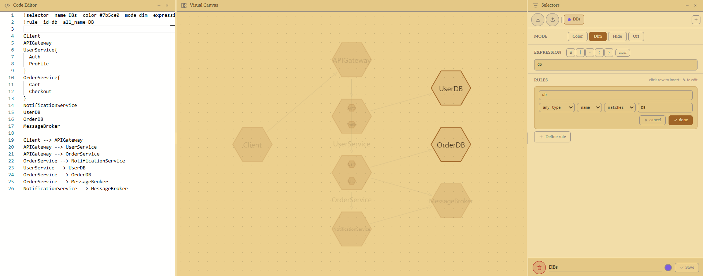

# Diagravinci — User Testing Guide

**App:** https://levkobe.github.io/diagravinci/

**Feedback form:** _(link TBD)_

**Time to complete:** ~15–20 minutes

Thank you for testing Diagravinci! It is a diagramming tool that lets you create diagrams in three ways at once — by writing code, by drawing visually, and by describing in natural language. Any feedback you have, no matter how small, is valuable.

---

## Before You Start

No account needed. No installation. Just open the link above in a desktop browser (Chrome or Firefox recommended).

---

## Tasks

You are welcome to play and experiment with the app. Alternatively, you can go through these tasks one by one. If something breaks or feels confusing, that is useful information — note it in the feedback form. You do not need to finish all tasks.

---

### Task 1 — Your first diagram (visual, ~3 min)

> Goal: create a small diagram by clicking, not typing.

1. In the toolbar, find the **Create** section (the first one on the left).
2. Click three times on the canvas to place three elements.
3. Switch to **Connect** mode (the **Mode** section) and draw a relationship from the first element to the second, and from the second to the third.
4. Switch back to **Select** mode and drag the elements around to rearrange them.

**Checkpoint:** Can you see your three elements connected in a chain?

---

### Task 2 — Edit via code (~3 min)

> Goal: use the code editor on the left to define a diagram.

1. Click into the **code editor** (left panel) and replace everything with:

```
user{} --> gateway() --> orders{}
gateway() --> auth()
orders{} --> database{}
orders{} --> notifications()
notifications() --> email()
```

2. Watch the canvas update as you type.
3. Try renaming `email` to `smtp` in the code. Does the canvas update?

**Checkpoint:** Do you see six elements on the canvas with the relationships you defined?

---

### Task 3 — Switch layouts (~2 min)

> Goal: see how the same diagram looks in different layouts.

With the diagram from Task 2 still on the canvas:

1. Find the **Layout** section in the toolbar (it shows the current layout).
2. Try switching between: **Hierarchical**, **Circular**, **Timeline**, **Pipeline**.
3. Notice how the structure changes without you changing the diagram data.

**Checkpoint:** Did all four layouts render your diagram differently?

---

### Task 4 — Load a template (~2 min)

> Goal: start from a pre-built architectural template.

1. Open the **Templates** panel (right side).
2. Browse or search for a template that sounds interesting.
3. Click on it.
4. Explore the result on the canvas and in the code editor.

**Checkpoint:** Did the template load and render on the canvas?

---

### Task 5 — Watch it run (~2 min)

> Goal: see the diagram come alive with execution simulation.

1. Open the **Templates** panel and find the **Execution** template collection. Apply any template from it.
2. In the **Run** section of the toolbar, press the **Play** (▶) button and watch tokens flow through the diagram.
3. Press **Pause** (⏸) to freeze the simulation mid-step.
4. Press **Step** (⏭) once to advance a single tick manually.
5. Press **Reset** (↺) to stop and clear all tokens.

**Checkpoint:** Did you see animated tokens moving along the relationships between elements?

---

### Task 6 — Filter and highlight (~3 min)

> Goal: use the filter system to focus on part of a large diagram.

1. Apply the **Microservices** template.
2. Open the **Selectors** modal via **Select** section in the toolbar or by creating a new window **Selectors**.
3. Create a new **selector** preset. Set its mode to **Dim** and add a name **rule** that matches one word from your diagram (e.g., `DB`).
4. Save both the **rule** and the **selector**.
5. Observe the canvas.



**Checkpoint:** Do non-matching elements dim out?

---

### Task 7 — Save and reload (~2 min)

> Goal: verify that state persists.

1. Make sure you have a diagram on the canvas.
2. Refresh the browser page (F5).
3. Check whether your diagram is still there.
4. _(Optional)_ Use **Save diagram** from the **Project** section in the toolbar to download a `.jsonl` file, then reload a fresh tab and use **Load diagram** to bring it back.

**Checkpoint:** Was your diagram restored after a refresh?

---

### Task 8 — AI generation _(optional, requires a free API key)_

> Goal: generate a diagram from a description.

1. Open the **AI** panel in the app.
2. Get a free API key from [Google AI Studio](https://aistudio.google.com/) (sign in with Google, click "Get API key").
3. Insert the API key into the AI panel (it is stored locally and not shared with anyone).
4. Type a prompt like: _"Draw a simple e-commerce system with a user, a cart, an orders service, and a database."_
5. Click **Generate** and observe the result.

**Checkpoint:** Did a diagram appear that roughly matches your description?

---

## After the Tasks

Please fill in the feedback form — it takes about 3 minutes. Even a single sentence ("the connect mode was confusing") is helpful.
